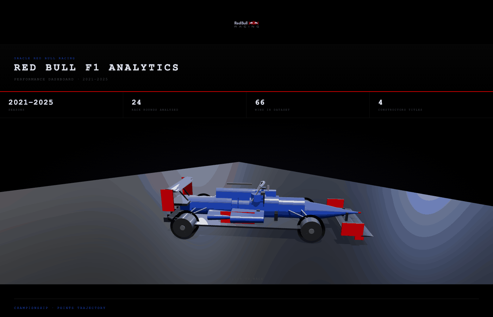

# Oracle Red Bull Racing · F1 Analytics

<p align="center">
  
</p>

<p align="center">
  <a href="https://github.com/Felixsavedra-1/redbullracing-f1-analytics/actions/workflows/ci.yml"></a>
  
  
  
  
</p>

> Production-style F1 data pipeline — 6 seasons, dual-source extraction, 7 statistical models, and a self-contained 3D dashboard with a playable race sim. No server required.

A resumable ETL pipeline that extracts Formula 1 race results and lap telemetry from two sources, validates every transform against explicit schema contracts, and loads a star-schema warehouse gated by 15+ CI-enforced quality checks. The analysis layer ships statistical models and an interactive Three.js dashboard that runs entirely in a single HTML file.

## Highlights

- **Dual-source ETL** — Ergast API for race results + FastF1 for lap-by-lap telemetry, 2020–2025, resumable with adaptive backoff
- **7 statistical models** — OLS regression, Poisson MLE, and 95% t-intervals over the loaded warehouse
- **CI-enforced quality** — 15+ post-load integrity gates plus `dbt compile` on every push
- **Self-contained dashboard** — Three.js PBR car, 7 Plotly charts, and an embedded physics-based F1 game in one HTML file
- **Modeled warehouse** — star schema on SQLite · MySQL · DuckDB, with dbt staging views and mart models

## Tech Stack

`Python` · `pandas` · `SQLite / MySQL / DuckDB` · `dbt` · `scipy` · `Plotly` · `Three.js` · `GitHub Actions`

## Quickstart

```bash
pip install -r requirements.txt
cp scripts/config.example.py scripts/config.py
python scripts/run_pipeline.py

# build charts + open the interactive dashboard
python scripts/run_analysis.py --export
open data/exports/dashboard.html
```

---

<details>
<summary><b>Pipeline</b> — extract → transform → load → quality → dbt</summary>

<br>

| Step | Script | Output |
|---|---|---|
| Extract | `extract_data.py` | `data/raw/*.csv` + resume state in `data/cache/` |
| Transform | `transform_data.py` | `*_ref` → `*_id` surrogate key resolution |
| Load | `load_data.py` | Schema-validated insert into database |
| Quality | `data_quality.py` | 15+ checks; raises in CI, warns locally |
| Lap telemetry | `extract_telemetry.py` | FastF1 → `laps` table (opt-in via `--telemetry`) |
| dbt | `dbt/` | Staging views + `driver_summary`, `pit_stop_efficiency`, `championship_progression`, `qualifying_vs_race` |

**Key flags**

| Flag | Description |
|---|---|
| `--telemetry` | Extract FastF1 lap data after load (sector times, tyre compounds, stints) |
| `--fast` | Demo mode: 2021–2025, reduced retries/backoff |
| `--start-year N` / `--end-year N` | Custom season range (default 2020–2025) |
| `--incremental` | Upsert instead of full refresh |
| `--skip-extract` / `--skip-load` | Run partial pipeline steps |

</details>

<details>
<summary><b>Analysis & Dashboard</b> — 7 statistical models + interactive 3D output</summary>

<br>

| Model | Method | Output |
|---|---|---|
| Championship trajectory | Cumulative points per driver per round | Line chart |
| Teammate comparison | Mean Δ position, 95% t-interval, p-value | Bar chart |
| Grid → finish | OLS regression — R², slope, significance | Scatter |
| Pit stop efficiency | Z-score vs season field | Bar chart |
| DNF rate | Poisson MLE, exact 95% CI | Bar chart |
| Tyre degradation | OLS lap time vs tyre age per compound | Bar chart |
| Pit strategy | Stint structure for most recent race | Gantt chart |

Tyre degradation and pit strategy require `--telemetry` data; the dashboard degrades gracefully, showing a placeholder until lap data is loaded.

**Dashboard** — self-contained HTML: Three.js PBR F1 car, 7 Plotly charts, and a playable F1 racing game with physics-based AI (Pacejka tyre model, PID steering), sector timing, and live race positions.

</details>

<details>
<summary><b>Data Model</b> — star schema (<code>f1_analytics.db</code>)</summary>

<br>

**Dimensions:** `circuits` · `seasons` · `constructors` · `drivers`
**Facts:** `races` · `results` · `qualifying` · `pit_stops` · `constructor_standings` · `driver_standings` · `laps`

The `laps` table stores per-lap telemetry — sector times, tyre compound, stint number, tyre age, track status — populated by `--telemetry`; empty tables are handled gracefully throughout the analysis layer.

Schema DDL: `database/schema/` · Validation contracts: `scripts/schema_contracts.py`

</details>

<details>
<summary><b>Quality Gates & Tests</b> — 15+ checks + unit/integration suites</summary>

<br>

15+ checks run after every load:

- **Non-empty** — `results`, `drivers`, `races` must have rows
- **Year bounds** — no out-of-range races; all expected seasons present
- **Uniqueness** — no duplicate PKs across dimension tables
- **FK integrity** — no orphaned keys in `results`, `qualifying`, `pit_stops`
- **Non-negative** — `points`, `laps`, `grid`, `position_order`
- **Lap data** — when `laps` is populated: time bounds (60–300 s), valid compounds, FK integrity

Failures raise `RuntimeError` in CI (`GITHUB_ACTIONS=true`). CI also runs `dbt compile` to validate all model SQL.

```bash
python -m unittest discover -s tests
```

| Suite | Coverage |
|---|---|
| `test_smoke` | End-to-end pipeline |
| `test_quality_checks` | Quality gate integration |
| `test_etl_unit` | Schema contracts, DNF sentinel, FK ref resolution |
| `test_analytics` | All 7 statistical models — empty-data and populated paths |

</details>

<br>

Full architecture → [`docs/ARCHITECTURE.md`](docs/ARCHITECTURE.md)

---

<p align="center">
  
</p>
