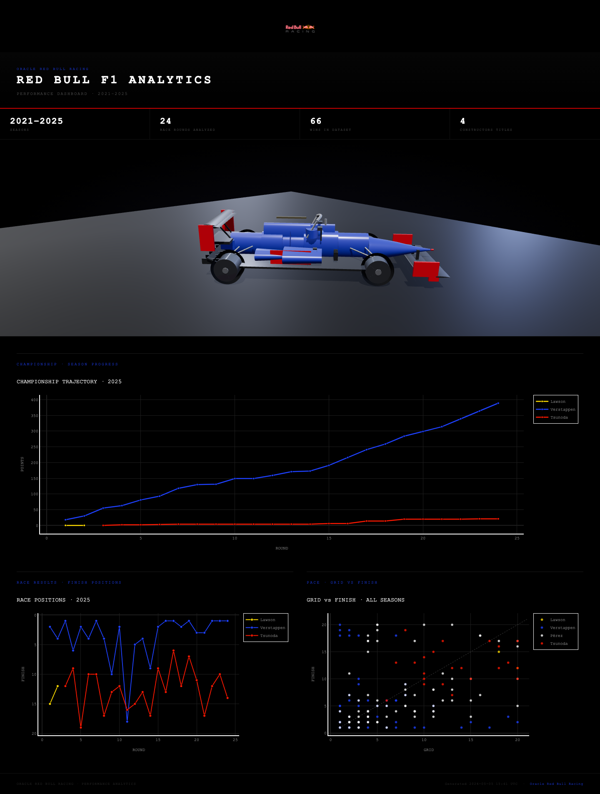

# Red Bull F1 Analytics



Python ETL pipeline extracting 6 seasons of Formula 1 race data from the Ergast API into DuckDB via a star schema, with resumable extraction, schema-validated transforms, and 15+ quality gates enforced in GitHub Actions CI. Analytical layer built with dbt, exposing 14 parameterized models consumed by Power BI and a 3D interactive dashboard.

## Stack

| Layer | Technology |
|---|---|
| Extraction | Python `requests` — resumable, adaptive backoff |
| Transformation | `pandas` — ref resolution, schema validation |
| Storage | DuckDB (default), SQLite, or MySQL |
| Analytical layer | dbt — staging views + materialized mart models |
| Analysis | SQL, `scipy` OLS/MLE, Jupyter, Power BI |
| Visualization | Plotly 3D, Three.js PBR |
| Source | [api.jolpi.ca/ergast/f1](https://api.jolpi.ca/ergast/f1) |

## Quickstart

```bash
pip install -r requirements.txt
cp scripts/config.example.py scripts/config.py
python scripts/run_pipeline.py
```

Pipeline runs extract → transform → load → quality checks → dbt models.

## Flags

```bash
python scripts/run_pipeline.py --fast                        # 2021–2025, reduced retries
python scripts/run_pipeline.py --start-year 2022 --end-year 2024
python scripts/run_pipeline.py --skip-extract                # reuse cached data
python scripts/run_pipeline.py --skip-pit-stops
python scripts/run_pipeline.py --incremental                 # upsert instead of full refresh
python scripts/run_pipeline.py --skip-dbt                    # skip dbt model build
python scripts/run_pipeline.py --base-delay 2.0 --max-retries 8
```

## dbt Models

```bash
cd dbt
dbt run    # build staging views + mart tables
dbt test   # not_null, unique, FK checks
```

**Staging** (views): `stg_results` · `stg_races` · `stg_drivers` · `stg_pit_stops` · `stg_qualifying` · `stg_constructor_standings`

**Marts** (tables): `driver_summary` · `pit_stop_efficiency` · `championship_progression` · `qualifying_vs_race`

Staging resolves the raw `position_order = 999` DNF sentinel to an `is_dnf` boolean used by all mart models. Pit stop efficiency uses `STDDEV()` — only possible with DuckDB.

## Analysis

```bash
python scripts/run_analysis.py --export
open data/exports/dashboard.html
```

| Model | Method |
|---|---|
| Championship trajectory | Cumulative points per driver per round |
| Teammate comparison | Mean position delta, 95% t-interval, p-value |
| Grid → finish | OLS, R², slope, significance |
| Pit stop efficiency | Z-score vs season field |
| DNF rate | Poisson MLE, exact 95% CI |

Self-contained HTML — no server. Three.js PBR car model (clearcoat paint, studio IBL, `LatheGeometry` tires) above three Plotly charts.

## Queries

14 parameterized SQL queries by constructor.

```bash
python scripts/run_queries.py --list
python scripts/run_queries.py --query driver_summary
python scripts/run_queries.py --query all --export
```

`driver_summary` · `championship_progression` · `pit_stop_efficiency` · `qualifying_vs_race_performance` · `reliability_analysis` · `failure_modes`

## Data Model

Star schema — `f1_analytics.duckdb`.

**Dimensions:** `circuits` `seasons` `constructors` `drivers`  
**Facts:** `races` `results` `qualifying` `pit_stops` `constructor_standings` `driver_standings`

Transform resolves `*_ref` string keys to integer `*_id` surrogates. DDL: `database/schema/`. Contracts: `scripts/schema_contracts.py`.

## Quality

15+ checks after each load (`--skip-quality` to bypass):

- **Non-empty** — `results`, `drivers`, `races`
- **Year bounds** — no out-of-range races; all expected years present
- **Uniqueness** — no duplicate PKs in dimensions
- **FK integrity** — no orphaned keys in `results`, `qualifying`, `pit_stops`
- **Non-negative** — `points`, `laps`, `grid`, `position_order`

In CI (`GITHUB_ACTIONS=true`), any failure raises `RuntimeError`. CI also runs `dbt compile` to validate all model SQL.

## Tests

```bash
python -m unittest discover -s tests
python -m unittest tests.test_smoke           # end-to-end pipeline
python -m unittest tests.test_quality_checks  # quality gate integration
python -m unittest tests.test_etl_unit        # schema, DNF sentinel, FK refs
```

## Other Databases

DuckDB requires no configuration. To switch:

```python
# scripts/config.py
DB_CONFIG = {"type": "sqlite", "filename": "f1_analytics.db"}    # SQLite
DB_CONFIG = {"type": "mysql",  "host": "...", "user": "...", ...} # MySQL
```

For MySQL, apply the schema first:
```bash
mysql -u root -p < database/schema/create_tables.sql
```

## Structure

```
├── dbt/
│   ├── dbt_project.yml
│   ├── profiles.yml
│   └── models/
│       ├── staging/           # thin views over raw tables
│       └── marts/             # materialized analytical models
├── data/
│   ├── raw/               # extracted CSVs
│   ├── processed/         # transformed CSVs
│   ├── cache/             # extraction resume state
│   └── exports/           # dashboard.html + charts/
├── database/
│   ├── queries/           # analytical_queries.yaml + .sql
│   └── schema/            # DDL for DuckDB, SQLite, and MySQL
├── scripts/
│   ├── run_pipeline.py    # main entry point
│   ├── run_analysis.py    # models + export
│   ├── run_queries.py     # query runner
│   ├── extract_data.py
│   ├── transform_data.py
│   ├── load_data.py
│   ├── analytics.py
│   ├── dashboard.py
│   ├── data_quality.py
│   └── schema_contracts.py
└── powerbi/
```

## Troubleshooting

**Rate limiting** — increase `--base-delay` (default 1.5 s) or narrow the year range. Extraction is resumable.

**Incomplete season** — unpublished rounds are skipped automatically.

**dbt errors** — run `dbt compile` first to catch SQL errors without needing a populated database. Set `F1_DUCKDB_PATH` env var if the database is not at the repo root.

**MySQL errors** — verify `scripts/config.py` and check server reachability (`mysql.server status`).
